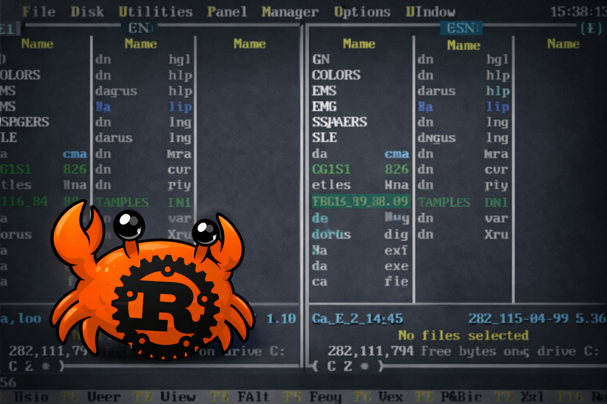
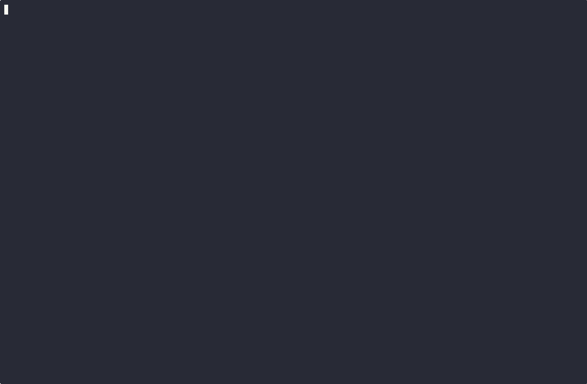

# rdn — Rust Dos Navigator

[](https://ratatui.rs/)

<p align="center">
  
</p>

<p align="center">
  
</p>

A modern terminal file manager written in Rust + [ratatui](https://github.com/ratatui/ratatui), visually inspired by the legendary [Dos Navigator](https://www.ritlabs.com/en/products/dn/) (1991–99) by RIT Research Labs.

> **⚠️ Disclaimer:** This is a fun one-hour vibe-coding project made with neural networks. Please don't take it seriously. It's literally just feeding the original [Dos Navigator source code](https://github.com/maximmasiutin/Dos-Navigator) to an AI and asking it to rewrite the whole thing in Rust — and it somehow just worked. No deep engineering, no grand architecture, just vibes.

Based on Dos Navigator by RIT Research Labs.

## Features

- **Two-panel interface** — classic orthodox file manager layout with 3-column Brief mode
- **DOS-accurate color theme** — dark gray panels, cyan cursor bar, exact VGA palette RGB values traced from the original Turbo Vision palette chain
- **Double-line borders** for the active panel, single-line for the inactive one
- **File operations** — copy (F5), move (F6), delete (F8), mkdir (F7)
- **Built-in file viewer** — text and hex modes (F3)
- **Quick search** — incremental filename search (Alt+F7)
- **File selection** — Insert to toggle, +/- for wildcards, * to invert
- **Sorting** — by name, size, date, extension (F9)
- **Hidden files** toggle (Ctrl+H)
- **Built-in Tetris** — because the original DN had one too (Ctrl+G)
- **Trash support** — files go to system trash on macOS/Linux

## Installation

```
cargo install --git https://github.com/apatrushev/rdn
```

Then just run `rdn` from anywhere.

## Building from source

```
cargo build --release
```

## Running

```
cargo run --release
```

## Keyboard Shortcuts

| Key | Action |
|---|---|
| Tab | Switch panel |
| Enter | Open directory / file |
| F3 | View file |
| F5 | Copy |
| F6 | Move |
| F7 | Make directory |
| F8 | Delete |
| F9 | Sort menu |
| F10 | Quit |
| Insert | Toggle select |
| +/- | Select/deselect by pattern |
| * | Invert selection |
| Ctrl+H | Toggle hidden files |
| Ctrl+G | Tetris |
| Alt+F7 | Quick search |

## Credits

This project is based on the original [Dos Navigator 1.51](https://www.ritlabs.com/en/products/dn/) source code, Copyright © 1991–99 RIT Research Labs (RITLABS S.R.L.). The original sources are available at [github.com/maximmasiutin/Dos-Navigator](https://github.com/maximmasiutin/Dos-Navigator).

The color theme, panel layout, keyboard bindings, and the built-in Tetris game are all derived from reading and reimplementing the original Borland Pascal + Turbo Vision codebase.

## License

The new Rust code in this repository is licensed under the MIT License (see below).

The original Dos Navigator source code included in the `Dos-Navigator/` directory retains its original license by RIT Research Labs. Per the requirements of that license:

> This product is free for commercial and non-commercial use as long as the following conditions are adhered to.
>
> Copyright remains RIT Research Labs, and as such any Copyright notices in the code are not to be removed. If this package is used in a product, RIT Research Labs should be given attribution as the RIT Research Labs of the parts of the library used.
>
> Redistribution and use in source and binary forms, with or without modification, are permitted provided that the following conditions are met:
>
> 1. Redistributions of source code must retain the copyright notice, this list of conditions and the following disclaimer.
> 2. Redistributions in binary form must reproduce the above copyright notice, this list of conditions and the following disclaimer in the documentation and/or other materials provided with the distribution.
> 3. All advertising materials mentioning features or use of this software must display the following acknowledgement: "Based on Dos Navigator by RIT Research Labs."
>
> THIS SOFTWARE IS PROVIDED BY RIT RESEARCH LABS "AS IS" AND ANY EXPRESS OR IMPLIED WARRANTIES, INCLUDING, BUT NOT LIMITED TO, THE IMPLIED WARRANTIES OF MERCHANTABILITY AND FITNESS FOR A PARTICULAR PURPOSE ARE DISCLAIMED. IN NO EVENT SHALL THE AUTHOR OR CONTRIBUTORS BE LIABLE FOR ANY DIRECT, INDIRECT, INCIDENTAL, SPECIAL, EXEMPLARY, OR CONSEQUENTIAL DAMAGES (INCLUDING, BUT NOT LIMITED TO, PROCUREMENT OF SUBSTITUTE GOODS OR SERVICES; LOSS OF USE, DATA, OR PROFITS; OR BUSINESS INTERRUPTION) HOWEVER CAUSED AND ON ANY THEORY OF LIABILITY, WHETHER IN CONTRACT, STRICT LIABILITY, OR TORT (INCLUDING NEGLIGENCE OR OTHERWISE) ARISING IN ANY WAY OUT OF THE USE OF THIS SOFTWARE, EVEN IF ADVISED OF THE POSSIBILITY OF SUCH DAMAGE.

### MIT License (for the Rust code)

```
MIT License

Copyright (c) 2025 rdn contributors

Permission is hereby granted, free of charge, to any person obtaining a copy
of this software and associated documentation files (the "Software"), to deal
in the Software without restriction, including without limitation the rights
to use, copy, modify, merge, publish, distribute, sublicense, and/or sell
copies of the Software, and to permit persons to whom the Software is
furnished to do so, subject to the following conditions:

The above copyright notice and this permission notice shall be included in all
copies or substantial portions of the Software.

THE SOFTWARE IS PROVIDED "AS IS", WITHOUT WARRANTY OF ANY KIND, EXPRESS OR
IMPLIED, INCLUDING BUT NOT LIMITED TO THE WARRANTIES OF MERCHANTABILITY,
FITNESS FOR A PARTICULAR PURPOSE AND NONINFRINGEMENT. IN NO EVENT SHALL THE
AUTHORS OR COPYRIGHT HOLDERS BE LIABLE FOR ANY CLAIM, DAMAGES OR OTHER
LIABILITY, WHETHER IN AN ACTION OF CONTRACT, TORT OR OTHERWISE, ARISING FROM,
OUT OF OR IN CONNECTION WITH THE SOFTWARE OR THE USE OR OTHER DEALINGS IN THE
SOFTWARE.
```
